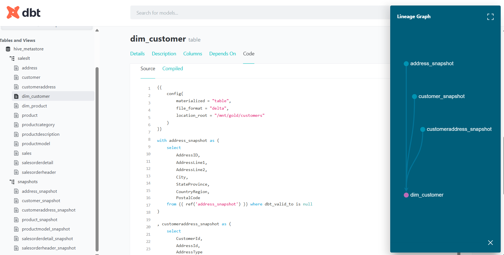

# Azure Data Pipeline with Medallion Architecture: AdventureWorks ETL/ELT


**Proyek ini** mengimplementasikan pipeline data end-to-end menggunakan **Azure Data Factory, Databricks, dan DBT** dengan pola medallion architecture (bronze → silver → gold) untuk dataset `AdventureWorks`.

---

## 📌 **Overview**
| Komponen               | Deskripsi                                                                 |
|------------------------|---------------------------------------------------------------------------|
| **Sumber Data**        | SQL Database (AdventureWorks)                                             |
| **Orchestration**      | Azure Data Factory (ADF)                                                  |
| **Transformasi**       | DBT (Data Build Tool) + Databricks                                        |
| **Penyimpanan**        | Azure Data Lake Storage Gen2 (Bronze/Silver/Gold)                         |
| **Output**             | Dimensional Model (Star Schema) di layer Gold                             |

---

## 🏗️ **Arsitektur**
  
*(Gantilah dengan diagram Anda atau tambahkan deskripsi tekstual jika gambar tidak tersedia)*

### **Alur Proses**
1. **Ingestion**: ADF menyalin data mentah dari SQL Database ke ADLS Gen2 (Bronze) dalam format Parquet.
2. **Cleaning**: Databricks memproses data Bronze ke Silver (Delta Lake) dengan DBT snapshot.
3. **Modeling**: DBT mengubah data Silver ke Gold (star schema) untuk analisis.

---

## ⚙️ **Teknologi Utama**
| Teknologi               | Penggunaan                                                                 |
|-------------------------|---------------------------------------------------------------------------|
| **Azure Data Factory**  | Orchestration pipeline, copy activity, linked services                    |
| **Azure Databricks**    | Mount ADLS, transformasi data dengan PySpark/Spark SQL                    |
| **DBT**                | Transformasi Silver → Gold, testing, dokumentasi otomatis                 |
| **ADLS Gen2**          | Penyimpanan data (bronze/silver/gold containers)                          |

---

## 📊 **Hasil Transformasi**
### **Layer Silver (DBT Snapshots)**
  
*Contoh: Tabel `address_snapshot` dengan historis perubahan.*

### **Layer Gold (Dimensional Model)**
  
*Contoh: Tabel dimensi `dim_customer` dan fakta `fact_sales`.*

---

## 🚀 **Cara Menjalankan Proyek**
### Prasyarat
- Azure subscription (ADF, Databricks, ADLS Gen2)
- DBT Core ≥ v1.10.1
- Python 3.8+

### Langkah-Langkah
1. **Clone Repo**:
   ```bash
   git clone https://github.com/username/azure-adventureworks-medallion-pipeline.git
